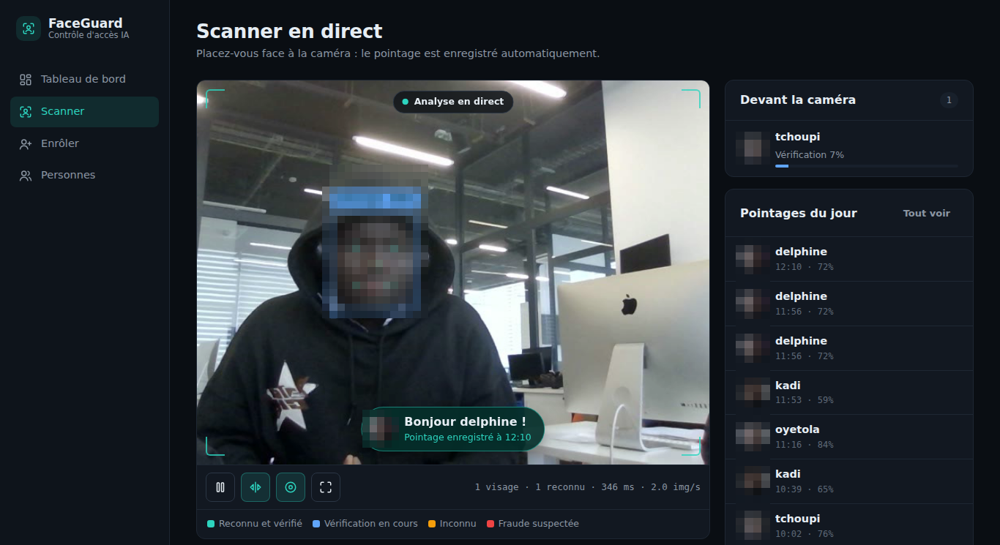
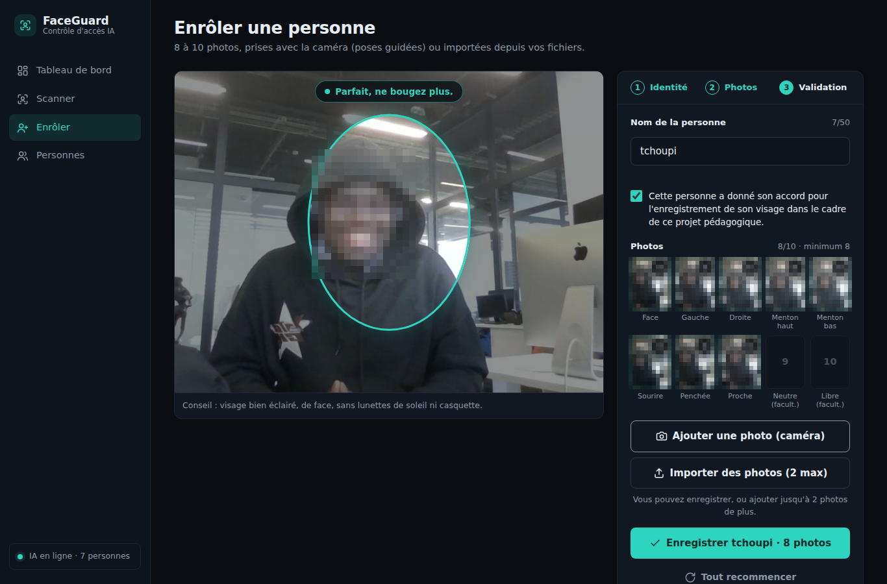
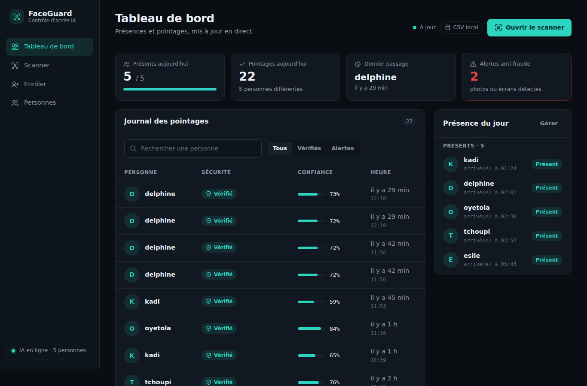
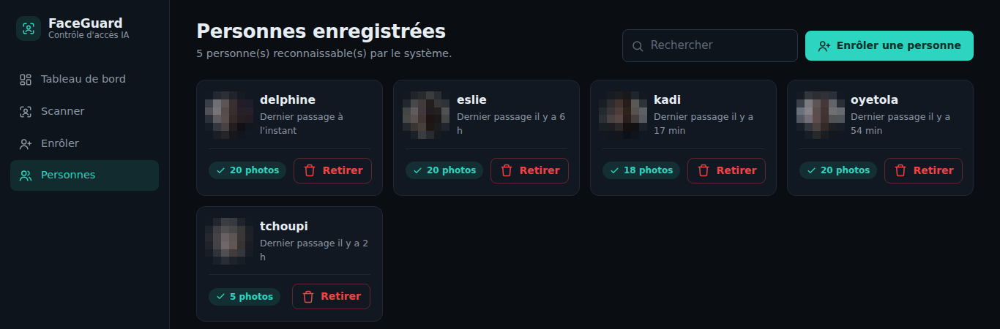
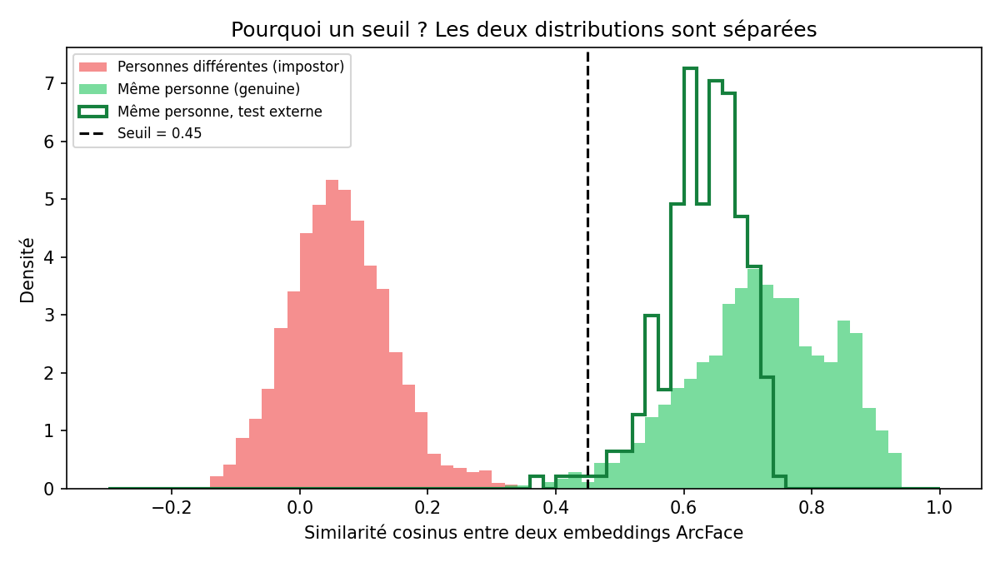

# FaceGuard — Détection et reconnaissance faciale en temps réel

Système qui capte le flux d'une webcam, détecte tous les visages présents, reconnaît
les personnes enregistrées et affiche un cadre et leur nom au-dessus de chaque visage
(ou « Inconnu »). Deux interfaces : une fenêtre OpenCV (scripts `src/`) et une
plateforme web avec tableau de bord de présence (`web/`).

> 📄 **Rapport de projet complet (PDF, 14 pages)** : [`docs/FaceGuard_rapport_projet.pdf`](docs/FaceGuard_rapport_projet.pdf) — toutes les étapes, des choix techniques à l'évaluation.

## Résultats (dataset de 5 personnes, seuil 0.45)

| Test | Résultat |
|---|---|
| Personnes connues, photos d'une autre séance | 12 / 12 bien reconnues |
| Personnes connues, leave-one-out | 97 / 97 |
| Personnes absentes de la base → « Inconnu » | 109 / 109, 0 faux positif |
| Equal Error Rate (comparaison de paires) | 0,10 % |

Détails, graphiques et temps de traitement : [`docs/evaluation_report.md`](docs/evaluation_report.md)
(régénéré par `python src/04_evaluate.py`).

## Captures d'écran

Les visages ont été pixelisés dans ces captures (données personnelles).

| Scanner en direct | Enrôlement guidé |
|---|---|
|  |  |
| **Tableau de bord** | **Personnes enregistrées** |
|  |  |

Courbes d'évaluation : `docs/similarity_distribution.png` (les deux distributions de similarité
sont bien séparées) et `docs/threshold_tradeoff.png` (compromis FAR / FRR selon le seuil).



## Fonctionnement

```
Webcam -> image -> SCRFD (détection + 5 points clés) -> alignement 112x112
       -> ArcFace (embedding 512-D, norme 1) -> FAISS (k plus proches voisins)
       -> vote k-NN + seuil de similarité -> lissage sur plusieurs images -> affichage
```

- **Détection vs reconnaissance** : SCRFD répond à « où sont les visages ? », ArcFace
  et la comparaison répondent à « à qui appartient ce visage ? ».
- **Embedding** : ArcFace transforme un visage en un vecteur de 512 nombres. Deux photos
  de la même personne donnent des vecteurs proches, deux personnes différentes des
  vecteurs éloignés.
- **Similarité cosinus** : les vecteurs sont normalisés, donc leur produit scalaire est
  le cosinus de leur angle (1 = identiques, 0 = sans rapport). FAISS le calcule pour toute
  la base en une fraction de milliseconde.
- **Seuil** : au-dessus de 0.45 on accepte l'identité, en dessous on répond « Inconnu ».
  Sur nos données, deux personnes différentes ne dépassent jamais 0.34 et la même personne
  descend rarement sous 0.45 (voir `docs/similarity_distribution.png`).
- **Vote k-NN (k=3)** : l'identité doit être confirmée par plusieurs voisins, ce qui limite
  les faux positifs dus à une seule photo trompeuse.
- **Lissage temporel** : chaque visage est suivi d'une image à l'autre ; le nom affiché
  est le vote majoritaire des 15 dernières prédictions.
- **Anti-spoofing (prototype)** : variation du ratio nez/yeux due aux micro-mouvements 3D.
  Une photo immobile est détectée, mais une photo qu'on bouge peut passer : ce n'est pas
  une vraie détection de vivacité.

## Installation

Python 3.10 à 3.12 conseillé.

```bash
python3 -m venv venv && source venv/bin/activate
pip install -r requirements.txt          # scripts src/ (webcam, encodage, évaluation)
pip install -r web/requirements.txt      # plateforme web
```

Les modèles InsightFace `buffalo_l` (~280 Mo) sont téléchargés automatiquement au premier lancement.

## Utilisation

```bash
# 1. Photographier une personne (qui a donné son accord) : 20 photos, une seule personne dans le champ
python src/01_capture_dataset.py --name marie --count 20

# 2. Construire la base de visages -> models/encodings_arcface.npz
python src/02_encode_faces.py

# 3. Reconnaissance temps réel (q = quitter, s = capture, l = anti-spoofing on/off)
python src/03_recognize_webcam.py
python src/03_recognize_webcam.py --det-size 320 --no-liveness   # PC lent / démo sans anti-spoofing

# 4. Évaluation complète -> docs/evaluation_report.md
python src/04_evaluate.py
```

Tests par condition (face, tête tournée, éclairage, plusieurs personnes, inconnus) :
suivre [`docs/protocole_tests.md`](docs/protocole_tests.md), puis relancer `04_evaluate.py`.

### Plateforme web

```bash
cd web
uvicorn app:app --host 127.0.0.1 --port 8001
```

| Page | Rôle |
|---|---|
| `/` | tableau de bord : pointages, présents du jour, tentatives suspectes |
| `/scanner` | reconnaissance en direct (webcam du navigateur) |
| `/register` | ajout d'une personne en 5 captures |
| `/people` | personnes connues, retrait d'une personne |

Supabase est **optionnel** : sans `web/.env`, les pointages sont enregistrés dans
`docs/recognition_log.csv` (ils y sont toujours copiés, même avec Supabase). Pour l'activer :

1. Dans Supabase, *SQL Editor*, exécuter [`docs/supabase_setup.sql`](docs/supabase_setup.sql) :
   crée la table `attendance_logs` et active la **Row Level Security**.
2. Créer `web/.env` avec la clé **service_role** (secrète, jamais dans le navigateur ni sur GitHub) :

   ```
   SUPABASE_URL=https://votre-projet.supabase.co
   SUPABASE_KEY=votre-cle-service-role
   ```
3. Vérifier avec le même Python que le serveur : `python scripts/diagnostic_supabase.py`.

Si Supabase n'est pas utilisé, le tableau de bord en affiche la raison.

Pour utiliser le scanner depuis un autre appareil que le serveur, le navigateur exige
HTTPS pour accéder à la caméra (sauf sur `localhost`).

### Docker

```bash
docker build -t faceguard -f web/Dockerfile .
docker run -p 8001:8001 --env-file web/.env -v "$PWD/models:/app/models" -v "$PWD/dataset:/app/dataset" faceguard
```

### Réglages

Tous les paramètres sont dans `core/config.py` et peuvent être changés par variable
d'environnement : `FACE_THRESHOLD`, `FACE_DET_SIZE`, `FACE_KNN_K`, `FACE_SMOOTHING`,
`FACE_LIVENESS=0`, `FACE_USE_GPU=1`.

## Organisation du code

```
core/                   cœur IA partagé par les scripts et le web
  config.py             chemins et paramètres
  engine.py             InsightFace + FAISS : détection, embedding, identification, base .npz
  tracking.py           suivi des visages, vote temporel, anti-spoofing
  drawing.py            affichage OpenCV (nom au-dessus du visage)
src/                    01 capture · 02 encodage · 03 webcam · 04 évaluation
web/                    FastAPI : app.py, engine/stream.py (WebSocket), database/, templates/, static/
dataset/<personne>/     photos de référence (non versionnées : données personnelles)
dataset_test_externe/   photos prises un autre jour, pour l'évaluation
models/                 base d'embeddings (.npz)
docs/                   rapport d'évaluation, graphiques, journal des pointages
legacy/                 anciennes versions (dlib, Flask), conservées pour l'historique
```

## Qualité du dataset : ce que l'analyse a montré

- 66 photos sur 100 contiennent plusieurs visages (personnes en arrière-plan).
- Avec la règle « garder le plus grand visage », 11 embeddings de l'ancienne base
  appartenaient à une autre personne. L'un des vecteurs « kadi » était en réalité le visage
  d'oyetola : si oyetola était absente de la base, elle était reconnue comme kadi 20 fois
  sur 20.
- L'encodage choisit maintenant, dans chaque photo, le visage cohérent avec les autres
  photos de la personne, et signale les photos inexploitables. La capture n'enregistre
  plus que les images avec un seul visage.

## Limites

- Anti-spoofing géométrique contournable (photo en mouvement, vidéo sur écran).
- Petit dataset (5 personnes, une ou deux séances) : les chiffres sont encourageants mais
  pas statistiquement solides. Il faudrait plus de personnes et d'autres conditions
  (éclairage, lunettes, masque, âge).
- Visages très tournés, flous ou trop petits (< ~40 px) : non détectés ou mal reconnus.
- Sur CPU, l'analyse de chaque image prend plusieurs centaines de ms selon la machine
  (voir le rapport) : utiliser `--det-size 320` ou `--process-every-n 2` si besoin.
- Biais possibles des modèles pré-entraînés selon les populations peu représentées dans
  leurs données d'entraînement.
- Données biométriques : consentement obligatoire, photos et embeddings à ne pas publier
  (exclus par `.gitignore`), droit de retrait via la page `/people`.
