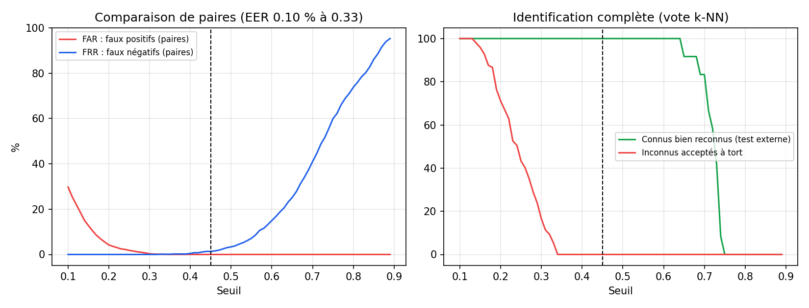

# Rapport d'évaluation — reconnaissance faciale ArcFace

Seuil de similarité : **0.45** · vote k-NN k=3 · det_size=640

## Dataset
- 5 personnes, 97 embeddings retenus
- 3 photo(s) ignorée(s) (pas de visage, ou visage d'une autre personne)
- 66 photo(s) contenant plusieurs visages

| Personne | Embeddings |
|---|---|
| delphine | 20 |
| eslie | 20 |
| kadi | 18 |
| oyetola | 20 |
| tchoupi | 19 |

## 1. Personnes connues
| Jeu de test | Bien reconnues | Mal reconnues | Non reconnues (« Inconnu ») | Total |
|---|---|---|---|---|
| Test externe (autre séance) | 12 (100.0 %) | 0 | 0 | 12 |
| Leave-one-out (dataset) | 97 (100.0 %) | 0 | 0 | 97 |

Le leave-one-out est optimiste : les photos d'une même séance se ressemblent beaucoup.
Le test externe (photos prises un autre jour) est plus représentatif de la démo.

## 2. Personnes absentes de la base
Chaque personne est retirée de la base puis présentée au système.
- Correctement rejetées (« Inconnu ») : **109 / 109** (100.0 %)
- Faux positifs (confondues avec quelqu'un) : **0**
- Similarité maximale observée pour un inconnu : 0.339

## 3. Choix du seuil
- Similarité moyenne même personne : 0.72 (min 0.321)
- Similarité moyenne personnes différentes : 0.062 (max 0.339)
- Au seuil 0.45 : FAR = 0.00 % · FRR = 1.34 %
- Equal Error Rate : 0.10 % (seuil 0.33)

## 4. Performances (CPU de la machine qui a lancé l'évaluation)
- Détection + embedding : 473.9 ms / image (médiane 471.3 ms)
- Recherche FAISS + vote : 0.019 ms
- FPS estimés (analyse de chaque image) : ~2.1

## Photos ignorées lors de l'encodage (à revoir)
- `kadi/kadi_003.jpg` : visage incohérent avec les autres photos (sim=0.15)
- `kadi/kadi_004.jpg` : visage incohérent avec les autres photos (sim=0.10)
- `tchoupi/tchoupi_000.jpg` : aucun visage détecté
